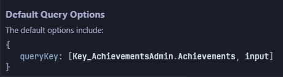

# AccelByte Gaming Services (AGS) TypeScript SDK

> **Note**: The AccelByte Gaming Service (AGS Typescript SDK is still under development. Some Extend SDK features may not be available yet.

The AGS TypeScript SDK is a versatile library for building web applications using AccelByte API services. It is platform-agnostic, making it suitable for both browser and server environments. Developed with TypeScript, the SDK emphasizes strict type safety, providing robust runtime type-checking to help you confidently work with AccelByte Gaming Service (AGS) type definitions.

This guide will walk you through getting started with the AGS TypeScript SDK, including installation and usage instructions.

## Installing AGS TypeScript SDK

We recommend installing the TypeScript SDK via npm using your preferred package manager. Open your terminal and run this command:

```bash
npm install @accelbyte/sdk @accelbyte/sdk-iam @accelbyte/sdk-basic # Add more SDK packages as needed
```

>**Important:** You must specifically install `@accelbyte/sdk` in your project as it has been moved to `peerDependencies` in other `@accelbyte/sdk-*` packages. This ensures that the core SDK is shared across all related modules.

*Optional*: If you plan to use our generated React Query hooks, you'll also need to install `@tanstack/query`. Note that we currently only support v4.

```bash
npm install @tanstack/react-query@4.36.1
```

Refer to the [AccelByte APIs](#accelbyte-apis) section to see the full list of services and SDK offered by AccelByte.

## Using AGS Typescript SDK

To begin using the AGS TypeScript SDK, you'll need to instantiate it with some basic configuration, including an IAM Client ID (`clientId`) and other core settings. Depending on your application, you may want to store environment variables in a `.env` file and load them using your development tools (e.g., via `process.env.ENV_KEY`).

```js
import { AccelByte } from '@accelbyte/sdk';

const sdk = await AccelByte.SDK({
  coreConfig: {
    baseURL: "<Your publisher base URL, e.g. <https://prod.gamingservices.accelbyte.io>>",
    clientId: "<Your publisher Client ID, e.g. 32_char_guid>",
    redirectURI: "<Your publisher Redirect URL, e.g. <https://prod.gamingservices.accelbyte.io>>",
    namespace: "<Your publisher namespace, e.g. 'accelbyte'>"
  },
  axiosConfig: {
    interceptors: [ 
      {
        type: 'response',
        name: 'disconnected',
        onError: e => {
          const error = e as AxiosError;
          const { config, response } = error;
          if (!response) {
            console.warn(`sdk:ERR_INTERNET_DISCONNECTED ${config?.baseURL}${config?.url}. ${error.message}\n`);
          }
          return Promise.reject(error);
        }
      }
    ],
    request: {
      withCredentials: true // If true, cookies will be sent automatically with requests.
    }
  }
});
```

### Configuration breakdown

>**Note:** When setting up IAM Clients, ensure that you include an additional Redirect URI with the format `{studio-namespace}.prod.gamingservices.accelbyte.io` (e.g., `accelbyte.prod.gamingservices.accelbyte.io`).

- **coreConfig**:
  - `baseURL`: The base URL for your AGS deployment. This is the starting point for all API requests.
  - `clientId`: The client ID. This is required for authentication with the IAM service. For more information about creating IAM clients, refer to the [AGS Documentation Portal](https://docs.accelbyte.io/gaming-services/services/access/authorization/manage-access-control-for-applications/#create-an-iam-client).
  - `redirectURI`: The URL to which users will be redirected after logging in.
  - `namespace`: The namespace for your AGS deployment, which helps in scoping API requests.

- **axiosConfig** (optional):
  - `interceptors`: Custom Axios interceptors to manage request and response behaviors. For example, you can add an interceptor to handle network errors.
  - `request`: Configuration for Axios request, such as setting `withCredentials` to `true` to include cookies automatically. For more information, refer to the [Axios documentation](https://axios-http.com/docs/req_config). Using cookies can help prevent unauthorized access, protect against Cross-Site Request Forgery (CSRF) attacks, and ensure that resources are only accessed by legitimate referrers.

## Interacting with AGS

This is a sample code snippet demonstrating how to use the SDK to interact with AGS:

```js
import { IamUserAuthorizationClient } from '@accelbyte/sdk-iam';
import { UserProfileApi } from '@accelbyte/sdk-basic';
// Log in to IAM using an authorization code
const token = await new IamUserAuthorizationClient(sdk).loginWithAuthorizationCode({ code, codeVerifier });
// Retrieve the current user profile
const userProfile = await UsersAdminApi(sdk).getUsersMe_v3();
```

## Integrating React Query

>**Note:** This is a browser-only integration.

If you're using `@tanstack/react-query` to manage server state, the AGS SDK offers seamless integration through generated queries and mutations. This allows you to efficiently fetch, update, and manage data while leveraging React Query's powerful features like caching, automatic retries, and query invalidation.

### Query example

To retrieve data using a generated query, you can use one of the SDK's hooks. The query key used in invalidation can be found within the generated queries.

```js
import { useUsersAdminApi_GetUsersMe_v3 } from '@accelbyte/sdk-iam';

const usersQuery = useUsersAdminApi_GetUsersMe_v3(
  sdk,
  { coreConfig: { namespace }, axiosConfig: {} },
  {
    retry: 2, // Retry the request twice before failing
  }
);

console.log(usersQuery.data);
```

Each generated query comes with unique query keys that you can use for query invalidation when it's necessary to refresh the data. You can view these keys by hovering over the generated query, as shown below:



### Mutation Example

To perform data mutations (e.g., creating, updating, or deleting resources), use one of the generated mutation hooks:

```js
import { useUsersAdminApi_UpdateUser_v3 } from '@accelbyte/sdk-iam';
import { useQueryClient } from '@tanstack/react-query';

const queryClient = useQueryClient();

const updateUserMutation = useUsersAdminApi_UpdateUserMutation_v3(
  sdk,
  {
    onSuccess: (data) => {
      console.log('User data updated:', data);
      // Invalidate the query to refetch the updated data
      queryClient.invalidateQueries({queryKey: [Key_UsersAdmin.User_v3]);
    },
    onError: (error) => console.error('Error updating user data:', error),
  }
);

updateUserMutation.mutate({ namespace, data: {/* updated user data */} });
```

In the example above, after a successful mutation, the corresponding query is invalidated using `queryClient.invalidateQueries({queryKey: [Key_UsersAdmin.User_v3] })`. This triggers a refetch to ensure the UI reflects the latest data.

These hooks provide a robust way to interact with AGS, making it easier to handle data fetching and state management within your React applications.

## Custom Network Calls

The SDK exposes public endpoints for common operations, but if you need to make a custom network call, you can do so using the SDK's network capabilities:

```js
async function customNetworkCall() {
  try {
    const url = '/iam/v3/public/users/me';
    const network = Network.create(sdk.assembly().axiosConfig.request);
    return await network.get(url);
  } catch (err) {
    console.error(err);
  }
}
```

This flexibility allows you to extend the SDK for specific use cases beyond the provided API methods.

## AGS SDK API

### AGS SDK Constructor

When creating an instance of the AGS SDK using `AccelByte.SDK(config)`, you need to provide a configuration object that adheres to the `SdkConstructorParam` interface.

```js
export interface SdkConstructorParam {
  coreConfig: MakeOptional<CoreConfig, 'useSchemaValidation'>
  axiosConfig?: AxiosConfig
}
```

This configuration consists of two main sections: `coreConfig` and `axiosConfig`. Here's a detailed breakdown of each section:

#### coreConfig

This is a required object that contains the core configuration for the SDK. It includes essential settings like `clientId`, `redirectURI`, `baseURL`, and `namespace`.

```js
export interface CoreConfig {
  clientId: string;
  redirectURI: string;
  baseURL: string;
  namespace: string;
  useSchemaValidation?: boolean;
}
```

The following table describes each parameter's function, type, and default value.


| Parameter                 | Type    | Description                                                                                                                                                                                                                                               | Default Value |
|-----------------------|---------|-----------------------------------------------------------------------------------------------------------------------------------------------------------------------------------------------------------------------------------------------------------|---------------|
| `clientId` (required)            | string  | The client ID associated with your SDK. You can obtain this from the AGS Admin Portal under OAuth Clients **Game Setup** > **Games and Apps** > **IAM Clients**.                                                                                                                                                |           |
| `redirectURI ` (required)        | string  | The URI to redirect to after a successful login. This value is crucial for generating a valid login URL to IAM and should match the redirect URI configured in the Admin Portal.                                                                          |           |
| `baseURL` (required)             | string  | The URI to redirect to after a successful login. This value is crucial for generating a valid login URL to IAM and should match the redirect URI configured in the Admin Portal.                                                                          |           |
| `namespace` (required)           | string  | The namespace associated with your AGS deployment.                                                                                                                                                                                                        |           |
| `useSchemaValidation` | boolean | Determines whether the SDK enforces the Zod schema validation at runtime. Setting this to `false` will bypass validation, which might be useful to prevent throwing errors if there are schema mismatches between the Zod model and the backend response. | true          |

#### axiosConfig (optional)

This object allows you to customize the Axios instance used by the SDK, such as adding interceptors or modifying request configurations.

```js
export interface AxiosConfig {
  interceptors?: Interceptor[];
  request?: AxiosRequestConfig;
}
```
  
- `interceptors` (`Interceptor[]`, optional): An array of interceptor objects that can modify requests or responses. These interceptors provide hooks for adding custom behavior before a request is sent or after a response is received.

  ```js
  export type Interceptor =
  | {
      type: 'request';
      name: string;
      onRequest?: (config: InternalAxiosRequestConfig) => InternalAxiosRequestConfig | Promise<InternalAxiosRequestConfig>;
      onError?: (error: unknown) => unknown;
    }
  | {
      type: 'response';
      name: string;
      onSuccess?: (response: AxiosResponse<unknown>) => AxiosResponse<unknown>;
      onError?: (error: unknown) => unknown;
    }
  ```

The following table describes each parameter's function, type, and default value.

| Parameter                 | Type     | Description                                                                                                                                                                                                                                               | Default Value |
|-----------------------|---------|-----------------------------------------------------------------------------------------------------------------------------------------------------------------------------------------------------------------------------------------------------------|---------------|
| `type` (required)     | `'request' \| 'response'`       | Specifies whether the interceptor should handle requests or responses.                                                                                                       |                                                                                      |
| `name` (required)     | string     | A unique name for the interceptor. This helps in identifying the interceptor, especially if you have multiple interceptors.                                                  |                                                                                                             |
| `onRequest` | `(config: InternalAxiosRequestConfig) => InternalAxiosRequestConfig \| Promise<InternalAxiosRequestConfig>`     | A function that processes the request configuration before the request is sent. This can be used to modify the request (e.g., adding headers) or to log the request details. |  |
| `onError`   | `(error: unknown) => unknown`     | A function that handles errors during the request or response process. This is useful for logging errors or retrying requests under certain conditions.                      |                                                                                |
| `onSuccess` | `(response: AxiosResponse<unknown>) => AxiosResponse<unknown>`     | A function that processes the response before it’s passed back to the calling code. This can be used to transform the response data or log successful requests.              |                                               |

- `request` (`AxiosRequestConfig`, optional): A configuration object that allows you to set default properties for Axios request, such as headers, timeout settings, or credentials handling. For more information, refer to the [Axios documentation](https://axios-http.com/docs/req_config).

### API Class

The API classes in the AGS TypeScript SDK, such as `*Api` for public endpoints and `*AdminApi` for admin endpoints, are constructed to interact with AGS. These classes offer methods to perform API operations, handling query parameters, request bodies, and returning the corresponding responses.

The API classes are instantiated using the following constructor:

```js
constructor(sdk: AccelByteSDK, args?: SdkSetConfigParam)
```

The following table describes each parameter's function, type, and default value.

| Parameter | Type  | Description                                                                                                                                             | Default Value     |
|-----------|--------|---------------------------------------------------------------------------------------------------------------------------------------------------------|-------------------|
| `sdk` (required)      | `AccelByteSDK` | An instance of the AGS SDK                                                                                                                        |       |
| `args`      | `SdkSetConfigParam`  | An optional parameter that allows you to override or extend the configuration of the SDK. This includes the core configuration and Axios configuration. |  |

## AGS APIs

TypeScript SDK supports the following AGS APIs:

- **Access**
  - [IAM](https://docs.accelbyte.io/api-explorer/#IAM): `@accelbyte/sdk-iam`
  - [GDPR](https://docs.accelbyte.io/api-explorer/#GDPR): `@accelbyte/sdk-event`
  - [Event Log](https://docs.accelbyte.io/api-explorer/#Event%20Log): `@accelbyte/sdk-event`
  - [Legal](https://docs.accelbyte.io/api-explorer/#Legal): `@accelbyte/sdk-legal`
- **Analytics**
  - [Game Telemetry](https://docs.accelbyte.io/api-explorer/#Telemetry): `@accelbyte/sdk-gametelemetry`
- **[Basic](https://docs.accelbyte.io/api-explorer/#Basic)**: `@accelbyte/sdk-basic`
- **Engagement**
  - [Achievement](https://docs.accelbyte.io/api-explorer/#Achievement): `@accelbyte/sdk-achievement`
  - [Challenge](https://docs.accelbyte.io/api-explorer/#Challenge): `@accelbyte/sdk-challenge`
  - [Leaderboard](https://docs.accelbyte.io/api-explorer/#Leaderboard): `@accelbyte/sdk-leaderboard`
  - [User-generated Content (UGC)](https://docs.accelbyte.io/api-explorer/#User%20Generated%20Content): `@accelbyte/sdk-ugc`
  - [SeasonPass](https://docs.accelbyte.io/api-explorer/#SeasonPass): `@accelbyte/sdk-seasonpass`
  - [Reporting](https://docs.accelbyte.io/api-explorer/#Reporting): `@accelbyte/sdk-reporting`
- **Monetization**
  - [Platform Store](hhttps://docs.accelbyte.io/api-explorer/?api=Platform%20Store#Platform%20Store): `@accelbyte/sdk-platform`
- **Play**
  - [Session](https://docs.accelbyte.io/api-explorer/#Session): `@accelbyte/sdk-session`
  - [Matchmaking](https://docs.accelbyte.io/api-explorer/#Matchmaking):`@accelbyte/sdk-matchmaking`
  - [Session Browser Play](https://docs.accelbyte.io/api-explorer/#Session%20Browser%20Play): `@accelbyte/sdk-sessionbrowser`
  - [Session History](https://docs.accelbyte.io/api-explorer/#Session%20History): `@accelbyte/sdk-history`
- **Social**
  - [Chat](https://docs.accelbyte.io/api-explorer/#Chat): `@accelbyte/sdk-chat`
  - [Lobby](https://docs.accelbyte.io/api-explorer/#Lobby%20-%20Friends,%20Presence%20and%20Notifications): `@accelbyte/sdk-lobby`
  - [Groups](https://docs.accelbyte.io/api-explorer/#Groups): `@accelbyte/sdk-groups`
- **Storage**
  - [CloudSave](https://docs.accelbyte.io/api-explorer/#CloudSave): `@accelbyte/sdk-cloudsave`
  - [Inventory](https://docs.accelbyte.io/api-explorer/#Inventory): `@accelbyte/sdk-inventory`
  - [Statistics](https://docs.accelbyte.io/api-explorer/#Statistics): `@accelbyte/sdk-social`
- `Add-ons`
  - [AMS](https://docs.accelbyte.io/api-explorer/#AMS): `@accelbyte/sdk-ams`

Check out the [AGS Documentation Portal](https://docs.accelbyte.io/gaming-services/services/) to learn more about the functions of these AGS services and how to integrate them into your game.

## Migrating from V3 guidelines

### SDK initialization

SDK now needs to be initialized with two fields: `coreConfig` and `axiosConfig`. This distinction clarifies which configurations apply to each component.

```js
// Before
const sdk = Accelbyte.SDK({
  options: {
    baseURL: 'http://localhost:3030/api',
    clientId: '77f88506b6174c3ea4d925f5b4096ce8',
    namespace: 'accelbyte',
    redirectURI: 'http://localhost:3030'
  },
  onEvents: {
    onGetUserSession: (accessToken, refreshToken) => {
      console.log('SDK Event: onGetUserSession', { accessToken, refreshToken })
    },
    onSessionExpired: () => {
      console.log('SDK Event: onSessionExpired')
    },
    onError: error => {
      console.error('SDK Event: onError', error.response)
    }
  }
})

// After
const sdk = AccelByte.SDK({
  coreConfig: {
    baseURL: 'http://localhost:3030/api',
    clientId: '77f88506b6174c3ea4d925f5b4096ce8',
    namespace: 'accelbyte',
    redirectURI: 'http://localhost:3030'
  },
  axiosConfig: {
    interceptors: [],
    requests: {}
  }
})
```

### Return response

API function calls are now returning `{ data, headers, status }` instead of just the data.

```js
- const data = await UsersAdminApi(sdk).getUsersMe_v3();
+ const { data, headers, status } = await UsersAdminApi(sdk).getUsersMe_v3();
```

### Events and Interceptors

The AGS SDK no longer has the ability to provide event listeners, e.g. `onSessionRenewed`. This capability is replaced by interceptors. Axios interceptors are now attached to the `axiosInstance` in the SDK instead of the global axios object. For example:

```js
// Before
const sdk = Accelbyte.SDK({
  options,
  onEvents: {
    onGetUserSession: (accessToken, refreshToken) => {
      console.log('SDK Event: onGetUserSession', { accessToken, refreshToken })
    },
    onSessionExpired: () => {
      console.log('SDK Event: onSessionExpired')
    },
    onError: error => {
      console.error('SDK Event: onError', error.response)
    }
  }
})

// After
const sdk = AccelByte.SDK({
  coreConfig: {
    baseURL: 'http://localhost:3030/api',
    clientId: '77f88506b6174c3ea4d925f5b4096ce8',
    namespace: 'accelbyte',
    redirectURI: 'http://localhost:3030'
  },
  axiosConfig: {
    interceptors: [
      createAuthInterceptor({
        clientId,
        onSessionExpired,
        onGetUserSession,
        getRefreshToken
      }),
      createCustomPathInterceptor(),
      {
        type: 'response',
        name: 'cancelled',
        onError: e => {
          const error = e as AxiosError
          if (axios.isCancel(error)) {
            // Expected case, exit
            return Promise.reject(error)
          }
          return Promise.reject(error)
        }
      },
      // Add more interceptors 
    ],
    requests: {}
  }
})
```

#### Interceptors

We now offer custom interceptors to replace certain events or options. Here's a list of interceptors available for event and option replacement:

- **onSessionExpired** and **onGetUserSession** (**createAuthInterceptor**)

  ```js
  createAuthInterceptor({
    /**
     * The client ID used by the SDK, obtained from the Admin Portal under OAuth Clients.
     */
    clientId: string
    /**
     * An optional array of URLs that should be ignored when handling session expiration.
     * Default to `['/iam/v3/oauth/token', '/iam/v4/oauth/token', '/iam/v3/oauth/revoke']`
     */
    expectedErrorUrls?: string[]
    /**
     * A callback function that retrieves the current refresh token.
     */
    getRefreshToken: () => string | undefined
    /**
     * The URL endpoint for obtaining a new token. Defaults to `'/iam/v3/oauth/token'`.
     */
    tokenUrl?: GrantTokenUrlString
    /**
     * A callback function triggered when the session has expired.
     */
    onSessionExpired: () => void
    /**
     * A callback function triggered when successfully get new session.
     */
    onGetUserSession?: (accessToken: string, refreshToken: string) => void
  })
  ```

- **onUserEligibilityChange**

  >**Note**: Since there's no dependency on the Internal SDK and it's specific to the application level, we have not created a custom wrapper for it.

  ```js
  {
      type: 'response',
      name: 'user-eligibilitiy-change',
      onError: e => {
        const error = e as AxiosError<any>
        if (error.response) {
          const { response } = error
          if (response?.status === 403 && (response?.config as any).url.includes(process.env.BASE_URL) && response?.config.withCredentials) {
            if (response.data.errorCode === ERROR_ELIGIBILITY_CODE) {
              // Do something when there's an error with ERROR_ELIGIBILITY_CODE
            }
          }
        }
        return Promise.reject(error)
      }
    }
  ```

- **onTooManyRequest**

  >**Note**: Since there's no dependency on the Internal SDK and it's specific to the application level, we have not created a custom wrapper for it.

  ```js
  {
      type: 'response',
      name: 'too-many-request',
      onError: e => {
        const error = e as AxiosError<any>
        if (error.response) {
          const { response } = error
          if (response?.status === 429 /* TooManyRequests */) {
            // onTooManyRequest(error)
          }
        }
        return Promise.reject(error)
      }
    }
  ```

- **useInternalNetwork** (**createCustomPathInterceptor**)

  ```js
  createCustomPathInterceptor({
    /**
     * A list of objects specifying which service base paths should be replaced.
     * For example, providing `{'/iam': '/iam-test'}` will redirect all `'/iam'` requests to `'/iam-test'`.
     */
    basePath: Partial<Record<BasePath, string>>
    /**
     * Indicates whether to use the internal AccelByte network. This should only be used in a server environment.
     * When set to true, requests will be made to `http://{service-name}/{path}` instead of the `baseURL`.
     */
    isInternalNetwork?: boolean
  })
  ```

### API Class Arguments

The `ApiArgs` (the second `*Api` argument) has been replaced by partial `coreConfig` and `axiosConfig` to make it consistent with the options passed in the initializer.

```js
// Before
const data = await UsersAdminApi(sdk, { namespace, config: {} }).getUsersMe_v3();
// After
const { data } = await UsersAdminApi(sdk, { coreConfig: { namespace }, axiosConfig }).getUsersMe_v3();
```

### Admin Class Endpoints

Admin endpoints that have the "Admin" tag in Swagger will only generate one "Admin" keyword. The `AdminPlayerRecordAdmin` has been replaced by `PlayerRecordAdmin`.

```js
- AdminPlayerRecordAdminApi(sdk).getRecords_ByUserId(userId)
+ PlayerRecordAdminApi(sdk).getRecords_ByUserId(userId)
```

### (Extend Functionality) Token Repository

Set the `accessToken` and `refreshToken` and update the Axios request headers to use Bearer authentication.

```js
setToken(token: TokenConfig) {
  this.token = {
    ...this.token,
    ...token
  }
}
removeToken() {
  this.token = {}
}
getToken() {
  return this.token
}
```

### refreshTokens method

The `refreshTokens` method is now replaced by `setToken({ accessToken, refreshToken })` with the same behavior.

```js
- sdk.refreshTokens(accessToken, refreshToken)
+ sdk.refreshTokens({ accessToken, refreshToken })
```

## TypeScript SDK Playground

You can live test the TypeScript SDK on the [AccelByte TypeScript SDK Playground](https://accelbyte.github.io/accelbyte-typescript-sdk).

## Frequently Asked Questions (FAQ)

### Can I install all the AGS SDK packages at once?

Yes, you can install all the AGS SDK packages in one command using the following `npm` command:

```bash
npm install @accelbyte/sdk @accelbyte/sdk-ams @accelbyte/sdk-achievement @accelbyte/sdk-basic @accelbyte/sdk-audit @accelbyte/sdk-buildinfo @accelbyte/sdk-challenge @accelbyte/sdk-chat @accelbyte/sdk-cloudsave @accelbyte/sdk-differ @accelbyte/sdk-dsmcontroller @accelbyte/sdk-event @accelbyte/sdk-gametelemetry @accelbyte/sdk-gdpr @accelbyte/sdk-groups @accelbyte/sdk-iam @accelbyte/sdk-inventory @accelbyte/sdk-leaderboard @accelbyte/sdk-legal @accelbyte/sdk-lobby @accelbyte/sdk-matchmaking-v1 @accelbyte/sdk-matchmaking @accelbyte/sdk-qosmanager @accelbyte/sdk-reporting @accelbyte/sdk-seasonpass @accelbyte/sdk-session @accelbyte/sdk-sessionbrowser @accelbyte/sdk-sessionhistory @accelbyte/sdk-social @accelbyte/sdk-ugc @accelbyte/sdk-platform
```

## Contributions

Thank you for your interest in contributing to the AGS TypeScript SDK. We value your input and appreciate your input to enhancing the AGS TypeScript SDK project. However, please note that direct contributions via GitHub are not currently accepted.

Instead, we encourage you to submit your ideas and suggestions as feature requests through the [AccelByte Customer Support Portal](https://accelbyte.atlassian.net/servicedesk/customer/portal/6) or via your Account Manager. This process helps us manage contributions effectively and ensures that each idea is carefully reviewed and considered by our team.